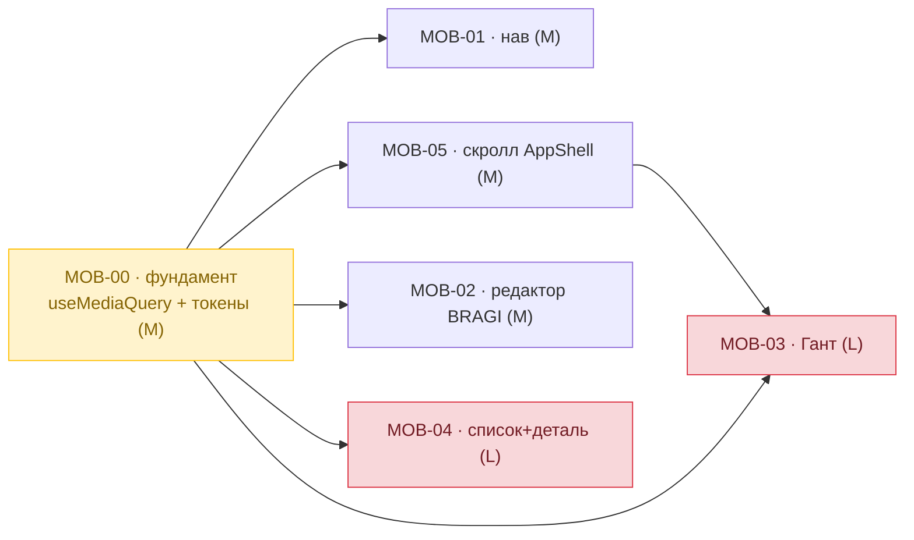
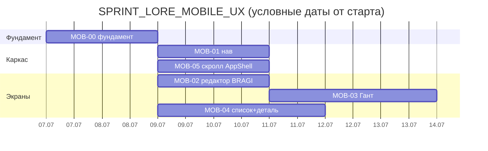

# ARCH · SPRINT_LORE_MOBILE_UX — адаптивная вёрстка LORE/BRAGI под мобильные

**Дата:** 2026-07-03 · **Объект:** фронтенд `lore-app` (React 19 / Vite 6) — AppShell + разделы Forseti/MUNINN/HUGINN/TYR/BRAGI + Технологии/QG
**Повод:** REN-00-превью публикации BRAGI «не умещается в плашку и криво обрезается» на узком экране → запрос на аудит мобильного представления и отдельный спринт.
**База фактов:** не гипотезы — измерено 2026-07-03 через device-emulation (Claude Preview, 375×812) с обходом разделов и замером `scrollWidth` vs `innerWidth` + поиском элементов шире вьюпорта. Кросс-чек в реальном Chrome (MCP `claude-in-chrome`, Browser 1) — см. методическую заметку ниже.
**Реализация:** спринт [[SPRINT_LORE_MOBILE_UX]] в LORE (компонент OMILORE), задачи MOB-00…MOB-05.

---

## 0. Текущее состояние (As-Is, факты 375px)

Приложение спроектировано под десктоп: IDE-подобные двухпанельные раскладки, `vis-timeline` Гант, фиксированные боковые панели, плотность 13px. На мобильном ширины ломаются, а `overflow:hidden` AppShell'а **режет** контент вместо адаптации.

| Экран | Замер @ 375px | Симптом |
|---|---|---|
| **Верхний нав** (AppShell) | ширина ~**447px** | ипостаси + палитра/тема/язык не помещаются, обрезаются справа |
| **План-борд / Гант** (Forseti) | `vis-item-content` **470–480px**, ряды контролов **~1100px** | жёсткий горизонтальный overflow, Гант нечитаем |
| **Редактор публикации BRAGI** (REN-00) | превью-панель держит `min-width:320px` → форма сжата до **~55px** | форма нередактируема, «не умещается в плашку» |
| **Списки+деталь** (спринты/компоненты/ADR) | две колонки с фиксир./resizable ширинами | деталь вытесняет список или наоборот |
| **AppShell inner** | `overflow-y:hidden`, `docOverflow=0` при `scrollWidth=vw` | overflow **клипается**, а не скроллится/переносится → «криво обрезается» |

**Методическая заметка (важно для MOB-00):** resize окна реального Chrome НЕ даёт честную мобильную эмуляцию — content-viewport застревает на ширине дисплея / DPR (замер вернул 1707px при окне 390px). Для достоверных замеров использовать **device-emulation** (Claude Preview `preview_resize mobile` или Chrome DevTools device toolbar), не resize окна.

---

## 1. Gap-анализ (As-Is → To-Be) по векторам

| Вектор | As-Is | To-Be | Разрыв | Действие |
|---|---|---|---|---|
| **Usability (mobile)** | десктоп-раскладки, контент обрезается | юзабельно на 360–414px: стак/скролл вместо клипа | нет брейкпоинтов, нет мобильных раскладок | MOB-00 фундамент → MOB-01..05 |
| **Accessibility** | пункты нава/секций — `span` без ролей; тач-цели <44px | роли + тач-цели ≥44px | не клавиатурно/скринридер-доступно | MOB-01 (+ EDIT-06 в BRAGI-спринте) |
| **Maintainability** | адаптив ad-hoc, инлайн-стили, магические ширины | единый `useMediaQuery` + брейкпоинт-токены | нет системы адаптива | MOB-00 |
| **Performance** | `vis-timeline` Гант тянет всю ширину на мобильном | скролл-контейнер / упрощённый мобильный вид | тяжёлый оффскрин-рендер | MOB-03 |

---

## 2. ТРИЗ — центральное противоречие

**Противоречие:** IDE-плотность на десктопе (максимум данных на пиксель — 13px, две колонки, Гант) ↔ мобильная читаемость (одна колонка, крупные тач-цели, ничего не режется).
**ИКР:** одна кодовая база даёт плотный десктоп И удобный мобильный без дубля экранов.
**Приём — разделение по условию (adaptive by breakpoint):** density-режим и раскладка переключаются на брейкпоинте через CSS-переменные и `useMediaQuery`; компоненты остаются одни, меняется только раскладочная обёртка (row↔column, panel↔drawer). Никаких отдельных «мобильных» дублей компонентов.

---

## 3. MoSCoW-приоритизация

| Приоритет | Задачи | Обоснование |
|---|---|---|
| **Must** | MOB-00 (фундамент), MOB-01 (нав), MOB-05 (клип AppShell), MOB-02 (редактор — активная жалоба) | без этого мобильный неюзабелен; MOB-02 закрывает прямой запрос |
| **Should** | MOB-03 (Гант), MOB-04 (список+деталь) | крупные экраны, но не блокируют базовый сценарий |
| **Could** | доводка density, per-section полировка, тач-жесты | улучшают UX, не критичны |
| **Won't (this sprint)** | нативное приложение, оффлайн, PWA-инсталл | вне scope |

---

## 4. Декомпозиция и фазы

### Фаза A — Фундамент
- **MOB-00** · `useMediaQuery`/`useIsNarrow` + брейкпоинт-токены (360/390/768/1024) в `tokens.css` + аудит всех разделов + density-режим. **M (~2 дн). Крит. путь — на нём стоят все MOB-*.**

### Фаза B — Каркас (глобальное)
- **MOB-01** · Адаптивный верхний нав: гамбургер / скролл-таб-бар; палитра/тема/язык → «⋯». **M (~2 дн).** Vector: Usability+A11y. DoD: нав ≤ vw на 360px, тач-цели ≥44px.
- **MOB-05** · Пересмотр скролл-модели AppShell: горизонталь переносится (wrap) или живёт в `overflow-x:auto`, а не режется. **M (~2 дн).** Корень «криво обрезается».

### Фаза C — Экраны
- **MOB-02** · Редактор BRAGI: стак форма/превью ниже брейкпоинта (или таб «Форма | Предпросмотр»). **M (~2 дн).** Прямо закрывает жалобу. Зависит от MOB-00.
- **MOB-03** · План-борд/Гант: скролл-контейнер + свёрнутые контролы + опц. упрощённый мобильный вид (список по датам). **L (~3 дн).** Худший офендер. Зависит от MOB-00, MOB-05.
- **MOB-04** · Списки+деталь → навигация «список → деталь → назад» (master-detail на телефоне). **L (~3 дн).** Зависит от MOB-00.

**Итого:** ~14 чел-дней.

---

## 5. Граф зависимостей и критический путь

**Критический путь:** `MOB-00 → MOB-05 → MOB-03` (2+2+3 = 7 дней). Всё остальное параллелится после MOB-00.

---

## 6. Риски и митигации

| # | Риск | Митигация |
|---|---|---|
| R1 | Инлайн-стили компонентов перебивают CSS-медиазапросы (специфичность) | MOB-00 даёт JS-`useMediaQuery` → раскладку переключать в JS, не только в CSS |
| R2 | `vis-timeline` плохо адаптируется — библиотека десктопная | MOB-03: обернуть в скролл-контейнер; если не хватит — упрощённый мобильный список (не форсить Гант) |
| R3 | Регресс десктопа при рефакторинге раскладок | брейкпоинт-обёртки аддитивны; десктоп-ветка = текущее поведение по умолчанию |
| R4 | Замеры на resize окна врут (viewport застревает) | только device-emulation; зафиксировано в MOB-00 |

---

## 7. Критерии приёмки спринта (NFR)

- На 360 / 390 / 768px во **всех** разделах: `document.scrollWidth ≤ innerWidth` (нет горизонтального клипа), либо намеренный `overflow-x:auto` контейнер.
- Верхний нав и его контролы доступны на 360px (гамбургер/скролл), тач-цели ≥44px.
- Редактор публикации BRAGI редактируем на 375px (форма не сжата).
- Гант: горизонтальный скролл вместо обрезки; контролы доступны.
- Десктоп (≥1024px) — без визуальных регрессов.
