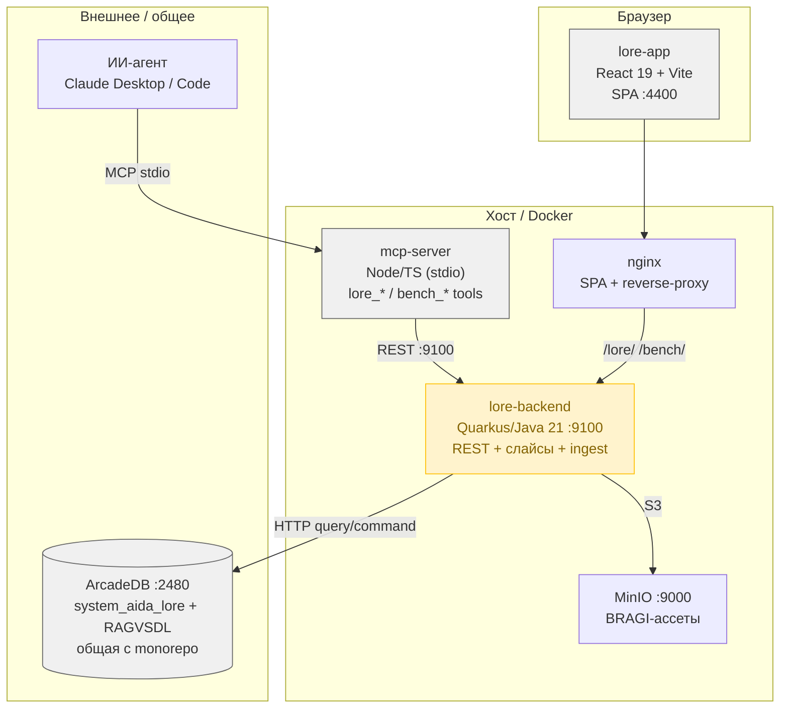

# Архитектурный аудит UnlimitedLORE

**Документ:** ARCH_06072026_16:00_AUDIT_UnlimitedLORE
**Дата:** 2026-07-06
**Режим:** Архитектурное ревью (Mode 1)
**Основание:** прямой анализ кода (backend Java/Quarkus, frontend React 19, mcp-server TS, инфраструктура). Факты — из кода, не из описания.

---

## 1. Текущее состояние (As-Is)

UnlimitedLORE — внутренний инструмент управления «знаниями» AIDA: спринты, задачи, ADR, решения, релизы, вехи, компоненты, документы, QG, публикации BRAGI. Историзация состояний через SCD2 (`*Hist`-вершины + `HAS_STATE`-рёбра) поверх общей ArcadeDB `system_aida_lore`.

### Состав системы (C4 Container)

Жёлтым помечен `lore-backend` — главный носитель технического долга (см. ниже).

### Ключевые метрики кодовой базы (факт)

| Компонент | Объём | Примечание |
|-----------|-------|-----------|
| backend | 20 Java-файлов, 7 885 строк | `AidaLoreResource.java` = **4 459 строк** (56% бэкенда) |
| frontend | ~30 800 строк TS/TSX | топ: `LoreAnalytics.tsx` 2 549, `BiblioScreen.tsx` 1 487 |
| mcp-server | 1 874 строки TS | `loreWrite.ts` = **1 612 строк** (86%) |
| Тесты | **0** (backend), **0** unit (frontend) | CI только `build` |

---

## 2. Что сделано хорошо ✅

Это не формальная вежливость — здесь есть зрелые решения, которые нужно сохранить и распространить как эталон.

1. **Read-path как декларативный реестр слайсов.** `LoreSlices.java` — именованные read-only слайсы с whitelist-регуляркой значений (`VALUE_RE`), объявляемые через фабрику `slice(id, sql, required, optional, suffix)`. Это правильный паттерн: SQL централизован, параметры валидируются, MCP и фронт получают один каталог (`GET /lore/slices`). **Это образец, которому write-path не следует.**

2. **Параметризованный SQL + валидация ID.** Вопреки первому впечатлению, запись идёт через именованные параметры (`:uid`, `Map.of(...)`), а идентификаторы прогоняются через `SAFE_ID = [A-Za-z0-9_./\-]{1,100}`. Риск SQL-инъекций **низкий** — это сделано правильно.

3. **Типобезопасный транспорт на фронте.** `src/api/lore.ts` — единый `fetchLoreSlice<T>()`, типизированные доменные ошибки (`LoreDisabledError`, `LoreUpstreamError`, `LoreNotFoundError`), проверка `content-type`. TS-дисциплина высокая: на 30k строк всего **4** `: any`, **0** `@ts-ignore`, **2** `console.log`.

4. **Тонкий MCP-клиент.** `mcp-server/src/backend.ts` — MCP не ходит в ArcadeDB напрямую, а переиспользует слайсы бэкенда; хелперы `json()`/`err()` убирают часть boilerplate; RBAC-заголовок `X-Seer-Role` пробрасывается.

5. **Дизайн-токены существуют.** `styles/tokens.css` (379 строк) + 2 117 обращений к `var(--…)` — база дизайн-системы есть.

6. **Продуманный nginx для SPA.** Тонкости кэширования `index.html` vs хешированных ассетов, `absolute_redirect off`, точные `location`-матчи — с комментариями, объясняющими каждое решение. Это уровень выше среднего.

7. **CI есть для всех трёх артефактов**, ветка `develop` защищена, релиз через feature-ветки + PR (по коммит-истории).

8. **Двуязычный i18n симметричен** — `en/common.json` и `ru/common.json` оба 1 551 строка.

---

## 3. Плохие архитектурные паттерны ❌

### 3.1 God-класс `AidaLoreResource.java` — 4 459 строк 🔴 **[критично]**

Один класс держит ~50 REST-эндпоинтов, всю SCD2-логику записи, композицию SQL, RBAC-гарды, DTO и обработку ошибок. 165 аннотаций пути/метода в одном файле. Последствия: невозможно ревьюить, тестировать по частям, высокий риск merge-конфликтов, любое изменение задевает несоседний код.

### 3.2 Отсутствие транзакций — не-атомарная запись 🔴 **[критично, корректность]**

**166** отдельных вызовов `writeClient.command(...)`, и `BEGIN/COMMIT` ArcadeDB **не используется вообще**. Пример `createTask` (`AidaLoreResource.java:717`): создать вершину → `PART_OF` → вставить Hist → `HAS_STATE` → опц. `IN_PHASE` — **5 независимых HTTP-команд** без отката. Падение на шаге 3 оставляет вершину-задачу с ребром `PART_OF`, но **без history-состояния** — ровно те «вершины-сироты» и «тихие no-op», что зафиксированы в рабочих заметках. Это системный риск целостности, а не разовый баг.

### 3.3 Копипаст SCD2 по 8 типам сущностей 🟡 **[унификация #1]**

Один и тот же паттерн close-open (закрыть открытый Hist → открыть новый → перевесить `HAS_STATE`) написан руками для каждого типа. По числу упоминаний Hist-классов в резолвере:

| Тип | Упоминаний | Тип | Упоминаний |
|-----|-----------|-----|-----------|
| KnowSprintHist | 14 | KnowPhaseHist | 5 |
| KnowTaskHist | 13 | KnowRunbookHist | 4 |
| KnowADRHist | 7 | KnowDocHist | 3 |
| KnowSpecHist | 5 | KnowReleaseHist | 2 |

Восемь почти идентичных реализаций вместо одной параметризованной. Отсюда же баги «матч по state_uid=null → тихий no-op» — их чинили по каждому типу отдельно.

### 3.4 RBAC — «доверяй заголовку», без аутентификации 🔴 **[безопасность]**

Авторизация = `if (!"admin".equals(role))` по значению заголовка `X-Seer-Role`, который клиент присылает сам (`AidaLoreResource.java:366`). Нет проверки подлинности — любой, кто отправит `X-Seer-Role: admin`, проходит гард. Сейчас смягчено тем, что бэкенд не публичный (dev-only, `lore.enabled`), но как модель безопасности это **декоративно**. То же на MCP: `LORE_SEER_ROLE ?? 'admin'` — дефолт admin.

### 3.5 Нет глобального ExceptionMapper 🟡

`@Provider`/`ExceptionMapper` отсутствуют. Обработка ошибок скопирована в каждый эндпоинт: **74** ручных формирования `ok`/`LoreError`, паттерн `try/catch → Response.status(BAD_GATEWAY)`. Единый маппер убрал бы ~несколько сотен строк дубля и унифицировал контракт ошибок.

### 3.6 MCP write-слой — 1 612 строк boilerplate 🟡 **[унификация #2]**

`loreWrite.ts` — каждый инструмент это ~20 строк `server.tool(name, desc, zodSchema, async handler → try/catch lorePost)`. Десятки почти одинаковых регистраций. Плюс `LORE_STATUS`-enum вручную «Keep in sync with» бэкендом (комментарий в коде) — рассинхрон ждёт своего часа.

### 3.7 Инлайн-стили обходят дизайн-систему 🟡 **[унификация #3]**

При наличии токенов: **1 643** инлайновых `style={{…}}`, **167** захардкоженных hex-цветов в TSX, ad-hoc паттерн `const S = {…}` в 25 файлах. Токены есть, но дисциплины их использования нет — визуальный разнобой и дубли отступов/цветов.

### 3.8 God-компоненты и разъезд состояния 🟡

`LoreAnalytics.tsx` 2 549 строк, ещё 6 файлов >800 строк. **569** `useState` + **147** `useEffect`, `createContext` **не используется** — серверное состояние тянется локально и prop-drilling'ом. **18** прямых `fetch()` в компонентах в обход `api/lore.ts` (напр. `LoreBragi*Editor.tsx`, `LoreQGDetail.tsx`) — часть транспорта утекла из единого слоя.

### 3.9 Мусор в репозитории 🟢 **[быстро]**

Закоммичены в корень: `C：Tempcomp.json` (битое имя), `area-colors.html`, `icon-assignment.html`, `picker-preview.html`, `qg-plan.html`, `gen_icons.js`, `inject_icons.js`, `gi_extra.txt/json`, `gi_inject.txt`, `gi_paths.txt` — экспериментальные генераторы иконок. `.gitignore` при этом корректен (dist/build/node_modules не в гите).

### 3.10 Прод-готовность инфраструктуры 🟡

- `backend/Dockerfile.local` копирует **prebuilt** `build/quarkus-app/` — образ не собирает jar, нужен ручной `./gradlew build` до `docker build` (легко забыть, Java-правки молча не попадают).
- `docker-compose.yml` с хардкодом Windows-путей (`C:/AIDA/rag-vs-parse`, `C:/AIDA/docs`) — непереносимо; дефолтные пароли `aida/aidapassword`, `ARCADEDB_ROOT_PASSWORD:unset`.
- nginx **без** security-заголовков (CSP, X-Frame-Options, X-Content-Type-Options) и без gzip.
- **Нет** healthcheck в compose, нет метрик (micrometer/prometheus), логирование не структурное (`quarkus.log`, категория DEBUG в проде).
- CI = только `build`: **ни тестов, ни lint, ни docker-build, ни деплоя**.

---

## 4. SWOT

| | **Полезные** | **Вредные** |
|---|---|---|
| **Внутренние** | **S:** декларативный read-реестр слайсов с whitelist; параметризованный SQL + `SAFE_ID`; типобезопасный API-слой (4 `any` на 30k); тонкий MCP поверх бэкенда; продуманный nginx; симметричный i18n | **W:** God-класс 4 459 строк; запись без транзакций (166 команд); SCD2 скопирован ×8 типов; RBAC без аутентификации; нет ExceptionMapper; 1 643 инлайн-стиля; 0 тестов |
| **Внешние** | **O:** обобщить write-path по образцу read-реестра; ввести транзакции ArcadeDB одним хелпером; вынести SCD2 в один generic-метод; глобальный маппер ошибок | **T:** общая `system_aida_lore` с monorepo — не-атомарная запись бьёт по общим данным; «доверяй заголовку» опасен при любой публикации порта; рассинхрон enum'ов backend↔MCP↔frontend |

## 5. Оценочная карта по векторам

| Вектор | Оценка | Комментарий |
|--------|:---:|-------------|
| Производительность | 4/5 | Reactive Quarkus (Uni), но каскад из 5 HTTP-команд на запись — round-trips |
| Масштабируемость | 3/5 | Stateless-бэкенд масштабируется, но общая БД и не-атомарность ограничивают |
| Отказоустойчивость | **2/5** | Нет транзакций → частичные записи; нет healthcheck/ретраев |
| Безопасность | **2/5** | Параметризованный SQL — плюс; RBAC без auth, дефолтные пароли, нет security-заголовков — минус |
| Наблюдаем100сть | **2/5** | Логи не структурные, нет метрик/трейсов, нет health |
| Сопровождаемость | **2/5** | God-класс 4 459, God-компонент 2 549, 0 тестов, копипаст SCD2 |
| Расширяемость | 4/5 | Новый read-слайс = 1 объявление; новый тип записи = копипаст всего блока |
| Стоимость | 4/5 | Внутренний инструмент, малая команда — TCO низкий |

---

## 6. Рекомендации (MoSCoW + горизонты)

### Must have — целостность и безопасность (сначала)

- **M1. Транзакции на все многошаговые записи.** Обернуть SCD2-переходы и create-цепочки в транзакцию ArcadeDB (session `BEGIN/COMMIT`, откат при ошибке любого шага). Закрывает 3.2 и корень «вершин-сирот». *Вектор: отказоустойчивость. Критерий: падение любого шага → 0 частичных записей.*
- **M2. Реальная аутентификация перед RBAC.** Пока порт `:9100` не публичен — минимум задокументировать модель угроз; при любой публикации — заменить «доверие заголовку» на проверяемый токен/JWT. *Вектор: безопасность.*
- **M3. Убрать мусор из репо и секреты из compose.** Удалить экспериментальные `*.html`/`gi_*`/`C：Tempcomp.json`; вынести пароли в `.env`, добавить `.env.example`. *Быстро, 1 коммит.*

### Should have — унификация (главная тема запроса)

- **S1. Generic SCD2-хелпер.** Один метод `scd2Transition(vertexClass, histClass, id, newState, fields)` вместо 8 копий. Устраняет 3.3 и класс багов «матч по null». *Вектор: сопровождаемость. Ожидаемо −500…800 строк.*
- **S2. Декларативный write-реестр** по образцу `LoreSlices`: описывать запись типами/схемами, а не копипастом эндпоинтов. Разбить `AidaLoreResource` (3.1) на ресурс-на-домен (Sprint/Task/ADR/…).
- **S3. Глобальный `ExceptionMapper`** — единый контракт ошибок, минус ~74 ручных обработчика (3.5).
- **S4. Единый источник enum'ов.** Статусы/типы генерировать/шарить между backend↔MCP↔frontend, убрать «keep in sync» (3.6).
- **S5. Табличная регистрация MCP-инструментов** — фабрика вместо 1 612 строк boilerplate (3.6).
- **S6. Дисциплина стилей** — линт-правило против инлайн-hex, миграция `style={{}}`→токены/CSS-модули поэтапно (3.7).

### Could have — прод-готовность

- **C1. Multi-stage `Dockerfile` для бэкенда** (gradle build внутри) — убрать ловушку prebuilt jar (3.10).
- **C2. Наблюдаемость:** `quarkus-smallrye-health` + healthcheck в compose, micrometer/prometheus, структурные логи JSON.
- **C3. nginx security-заголовки + gzip.**
- **C4. CI:** добавить typecheck-gate, тесты, `docker build`.
- **C5. Тесты** — начать с write-path (SCD2-переходы, транзакционный откат) как самого рискового.

### Won't (this time)

- Смена БД/полный микросервисный распил — не оправдано для внутреннего инструмента с малой командой.

---

## 7. Резюме одним абзацем

UnlimitedLORE держит **отличный read-path** (декларативный реестр слайсов с whitelist, параметризованный SQL, типобезопасный фронт) и **слабый write-path** (God-класс 4 459 строк, запись без транзакций, SCD2 скопирован по 8 типам, RBAC без аутентификации, ноль тестов). Главная работа по приведению в продакшен — не переписывание, а **обобщение write-path по образцу уже существующего read-path**: транзакции (M1), один SCD2-хелпер (S1), декларативный write-реестр вместо копипаста (S2), глобальный маппер ошибок (S3). Это одновременно закрывает и корректность (вершины-сироты), и сопровождаемость (−1000+ строк дубля).
